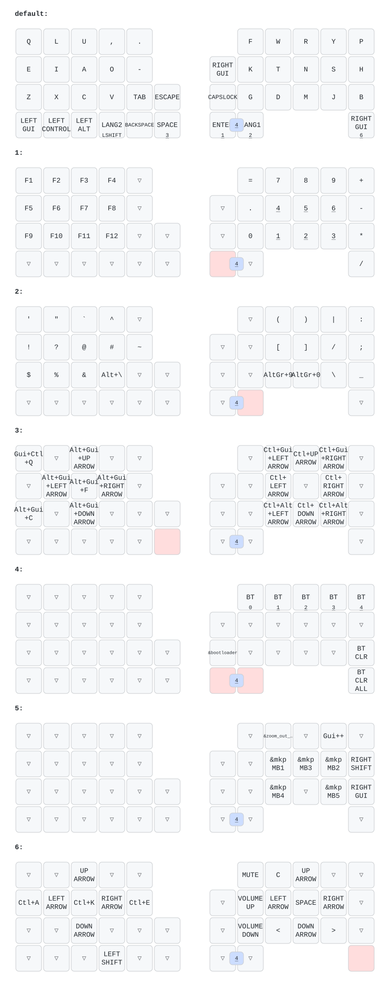

# zmk-config-moNa2（kb-no）

[sayu-hub/zmk-config-moNa2-v2](https://github.com/sayu-hub/zmk-config-moNa2-v2) をフォークした、自分用の moNa2（右手トラックボール版）のファームウェア設定です。ZMK v0.3 を使っています。

この図は、`config/mona2.keymap` を変更するたびに GitHub Actions（Draw ZMK Keymap）が自動で描き直します。

## 元の設定から変えたこと

| 項目 | 内容 | 場所 |
|---|---|---|
| キー配置 | KeymapEditor で作り直し（下の「レイヤー」） | `config/mona2.keymap` |
| トラックボールの向き | COROPIT 版の向き（`invert-x` / `invert-y` を有効） | `boards/shields/mona2/mona2_r.overlay` |
| オートマウス | ボールを動かすとレイヤー5 に入る。最後に動かしてから10秒たつか、マウス用以外のキーを押すと元に戻る | `mona2.dtsi`（`zip_temp_layer 5 10000`）、`mona2_r.overlay`（`excluded-positions`） |
| スクロール | レイヤー6 の間、ボールでスクロール（縦・横、速さ 1/15） | `mona2_r.overlay`（`scroller`） |
| ⇧ + ⌫ で Delete | mod-morph の `&bspc_del` | `boards/shields/mona2/mona2.dtsi` |
| レイヤー4 | 右手親指の英数とかなの同時押しでだけ入る | `config/mona2.keymap`（同時押し `layer4`） |

## レイヤー

| レイヤー | 入り方 | 中身 |
|---|---|---|
| 0 default | ― | 文字。A・- の長押しで ⇧、Z の長押しで ⌘、⇧ + ⌫ で Delete |
| 1 | Enter を長押し | 数字（右手に電卓の並び）・F1〜F12・= + - * / . |
| 2 | Space を長押し | 記号・¥・\・【】 |
| 3 | 英数を長押し | ウィンドウとデスクトップの操作（⌃← ⌃→ でデスクトップの切り替え、⌃↑ で Mission Control など。ノブで音量） |
| 4 | 英数とかなを同時に長押し | Bluetooth の切り替えと消去、書き込みモード |
| 5 MOUSE | ボールを動かす（自動） | J で左、L で右、K で中クリック。M で戻る、. で進む |
| 6 SCROLL | P を長押し | 矢印・音量・ミュート。ボールでスクロール |

同時押しは、S + D で Tab、英数 + かなでレイヤー4 です。

## Mac 側の設定（つなぐ Mac すべてで必要）

1. キーボードの種類: **ANSI**
2. 日本語入力の「“¥”キーで入力する文字」: **\（バックスラッシュ）**
   - 記号レイヤーの V で ¥、. で \ が出るのは、この設定が前提です。初期値の「¥」のままだと逆になります。
3. 日本語入力の「Windows風のキー操作」: **オフ**
   - IME の変換が ⌃J・⌃K・⌃L・⌃; にそろいます。

2 と 3 は、日本語入力に切り替えてから、メニューバーの入力メニュー →「“日本語 - ローマ字入力”設定を開く…」の中にあります。

## ファームウェアの書き込み

1. `main` に push すると、GitHub Actions がビルドします。Actions の実行結果から `firmware` をダウンロードします。
2. 右手側を USB でつなぎ、**英数とかなを押したまま Caps Lock の位置**を押して、書き込みモードに入ります。リセットボタンを素早く2回押しても入れます。
3. 現れた `XIAO-SENSE` ドライブに、`mona2_r rgbled_adapter-seeeduino_xiao_ble-zmk.uf2` をコピーします。

- キーマップや右手側の設定だけを変えたときは、右手側だけ書き込めば大丈夫です。`settings_reset` も要りません。
- 電源は、左手側 → 右手側の順に入れます。

## 編集するときの注意

- KeymapEditor で編集する前に、更新ボタン（↻）を押して最新の状態を読み込みます。Actions が図を更新するコミットを足すためです。
- KeymapEditor は保存するときに、キーマップの中の独自の behavior 定義（mod-morph など）を消してしまうことがあります。独自の定義は `boards/shields/mona2/mona2.dtsi` に置きます。KeymapEditor では `&bspc_del` が赤く表示されますが、正常です。
- `mona2.dtsi` で `dt-bindings/zmk/keys.h` を読み込むときは、配線表（`RC(行,列)`）より後にします。先に読み込むと `RC` という名前がぶつかって、ビルドが失敗します。
- ZMK Studio は使いません。Studio で変えた内容はキーボード本体に保存され、ファイルのキーマップより優先されてしまうためです。

## 元のリポジトリ

- 作者の設定と説明（COROPIT 版の設定方法など）: [sayu-hub/zmk-config-moNa2-v2](https://github.com/sayu-hub/zmk-config-moNa2-v2)
- 作者が描いた元のキーマップ図: [`keymap-drawer/mona2_01.svg`](keymap-drawer/mona2_01.svg)
